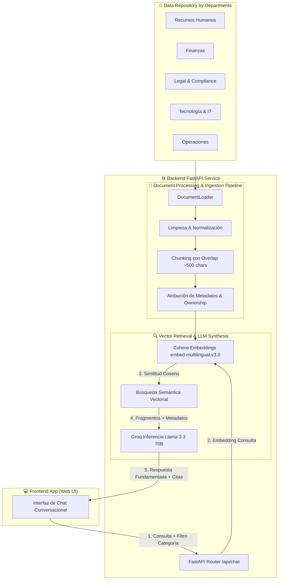

# 🤖 Agente Corporativo de IA con Gobernanza de Datos y RAG Multi-Formato


> **Solución Empresarial Inteligente** desarrollada para el **Desafío Alura Agentes IA**. Transforma repositorios documentales corporativos desestructurados en una base de conocimiento activa con gobernanza estricta por departamentos, trazabilidad de ownership, extracción multi-formato con OCR y capacidades de búsqueda en la web en tiempo real.

---

## 📌 Tabla de Contenidos
- [🎯 Visión General](#-visión-general)
- [🏛️ Arquitectura del Sistema](#️-arquitectura-del-sistema)
- [✨ Características Principales](#-características-principales)
- [📊 Mapeo y Gobernanza de Datos](#-mapeo-y-gobernanza-de-datos)
- [🔄 Pipeline de Procesamiento de Documentos](#-pipeline-de-procesamiento-de-documentos)
- [🛠️ Tecnologías Utilizadas](#️-tecnologías-utilizadas)
- [🚀 Guía de Instalación y Despliegue](#-guía-de-instalación-y-despliegue)
- [📑 Documentación de la API (Endpoints)](#-documentación-de-la-api-endpoints)
- [📁 Estructura del Proyecto](#-estructura-del-proyecto)
- [📄 Licencia](#-licencia)

---

## 🎯 Visión General

El **Agente Corporativo de IA** resuelve el problema común en las organizaciones donde la información crítica (políticas de Recursos Humanos, presupuestos de Finanzas, manuales de Tecnología o contratos de Legal) se encuentra dispersa en múltiples archivos PDF, Word, Excel o PowerPoint.

Mediante una arquitectura **RAG (Retrieval-Augmented Generation)** avanzada asistida por **Cohere Embeddings Multilingües** y **Groq Llama 3.3 70B**, el agente no solo responde dudas de colaboradores de forma precisa y concisa, sino que **garantiza la gobernanza de datos**:
- **Cita las fuentes oficiales exactas** indicando el archivo original, la ubicación interna (Página, Diapositiva, Hoja/Fila) y la fecha de actualización.
- **Asigna Ownership (Responsables de Área)** para que el colaborador sepa a quién contactar si requiere profundizar una solicitud.

---

## 🏛️ Arquitectura del Sistema



---

## ✨ Características Principales

1. **Gobernanza Organizacional y Trazabilidad (Etapa 1)**:
   - Clasificación jerárquica automática de información por departamentos (RH, Finanzas, IT, Legal, Operaciones).
   - Atribución explícita de *Ownership* (correos de los responsables oficiales de cada área).

2. **Procesamiento y Extracción Multi-Formato (Etapa 2)**:
   - **PDF Nativo y Escaneado**: Extracción página a página con fallback OCR (`pytesseract` + `pdf2image`).
   - **Word (`.docx`)**: Preservación de estructura de títulos y tablas.
   - **PowerPoint (`.pptx`)**: Extracción de diapositivas e inclusión de **Notas del Orador** (*Speaker Notes*).
   - **Excel (`.xlsx`, `.csv`)**: Conversión a texto estructurado repitiendo los encabezados por fila.
   - **Markdown, JSON, HTML**: Despojado de marcas técnicas y etiquetas ruidosas.

3. **Chunking Inteligente y Limpieza Profunda**:
   - Eliminación de ruidos, encabezados/pies repetidos y caracteres corruptos.
   - División en fragmentos con superposición (*overlap*) para preservar la continuidad semántica de cada idea.

4. **Búsqueda Semántica de Alta Fidelidad (Cohere RAG)**:
   - Embeddings multilingües con el modelo `embed-multilingual-v3.0` de Cohere.
   - Filtrado dinámico por categorías de negocio.

5. **Capa de Recuperación y Reranking**:
   - La pregunta del colaborador se transforma en un embedding para compararla semánticamente con los fragmentos ya indexados.
   - La búsqueda vectorial devuelve los candidatos más cercanos, no solo por coincidencia literal de palabras, sino por significado.
   - Antes o después de esa etapa se aplican filtros por metadatos como categoría, fecha o ownership para descartar información obsoleta o fuera de contexto.
   - Luego entra en juego el reranking, que reevalúa los candidatos más prometedores con un criterio más preciso y reordena los resultados para conservar solo los fragmentos más útiles.
   - Los fragmentos finales se ensamblan con sus metadatos de origen y se entregan al LLM como contexto para generar una respuesta fundamentada.
   - Esta etapa es el corazón del RAG: si la recuperación es débil, incluso un LLM muy potente puede responder de forma imprecisa o inventar contenido.

6. **Inferencia Ultra-Rápida y Confiable (Groq LLM)**:
   - Generación de respuestas concisas y amables utilizando `llama-3.3-70b-versatile` servido por la infraestructura LPU de Groq.
   - Principio "Garbage in, garbage out": Si la información no está en las fuentes oficiales, aconseja contactar al responsable del área.

---

## 📊 Mapeo y Gobernanza de Datos

| Subcarpeta | Categoría / Área Asignada | Responsable Oficial (Ownership) |
| :--- | :--- | :--- |
| `data/rh/` | Recursos Humanos | `rh@aluratech.com` |
| `data/financiero/` | Finanzas y Presupuestos | `finanzas@aluratech.com` |
| `data/juridico/` | Legal y Compliance | `legal@aluratech.com` |
| `data/tecnologia/` | Tecnología y Ciberseguridad | `it@aluratech.com` |
| `data/operaciones/` | Operaciones y Procesos | `operaciones@aluratech.com` |

---

## 🔄 Pipeline de Procesamiento de Documentos

El procesamiento transforma documentos brutos en vectores limpios con metadatos:

```
[ Archivo Fuente ] ➡️ [ 1. Extracción por Formato ] ➡️ [ 2. Limpieza de Texto ] ➡️ [ 3. Chunking + Overlap ] ➡️ [ 4. Metadatos & Embeddings ]
```

1. **Extracción**: Identifica la extensión y aplica la estrategia adecuada (lectura por páginas, notas de orador o celdas).
2. **Limpieza**: Remueve caracteres no imprimibles (`\x00`), saltos triples y ruidos como "Página X de Y".
3. **Chunking**: Fragmenta el texto en ventanas de ~500 caracteres con 100 caracteres de superposición.
4. **Metadatos**: Asigna Categoría, Responsable, Ubicación exacta (`Página X`, `Diapositiva Y`, `Fila Z`) y Fecha.

---

## 🛠️ Tecnologías Utilizadas

- **Lenguaje**: Python 3.10+
- **Framework Web Backend**: FastAPI + Uvicorn
- **Framework de IA & Agentes**: Cohere y Groq
- **Embeddings & RAG**: Cohere API (`embed-multilingual-v3.0`)
- **LLM Inferencia**: Groq API (`llama-3.3-70b-versatile`)
- **Procesamiento Documental**: PyPDF, python-docx, python-pptx, openpyxl, pandas, BeautifulSoup4, pytesseract

---

## 🚀 Guía de Instalación y Despliegue

### Requisitos Previos
- Python 3.10 o superior
- Git
- Claves de API activas (Cohere y Groq)

### 1. Clonar el Repositorio
```bash
git clone https://github.com/heiner-godoy/Challenge.git
cd Challenge
```

### 2. Configurar el Entorno del Backend
```bash
cd back-end
python3 -m venv .venv
source .venv/bin/activate
pip install -r requirements.txt
```

### 3. Configurar Variables de Entorno (`.env`)
Edita el archivo `back-end/.env` con tus credenciales:
```env
PORT=8000
HOST=0.0.0.0

COHERE_API_KEY=tu_cohere_api_key_aqui
GROQ_API_KEY=tu_groq_api_key_aqui

COHERE_EMBEDDING_MODEL=embed-multilingual-v3.0
GROQ_MODEL=llama-3.3-70b-versatile
DATA_DIR=./data
```

### 4. Ejecutar el Servidor Backend
```bash
cd back-end
source .venv/bin/activate
python main.py
```
El servidor se iniciará en `http://localhost:8000`. Puedes acceder a la documentación interactiva Swagger UI en:
👉 `http://localhost:8000/docs`

### 5. Ejecutar el Frontend Web
```bash
cd front-end
npm install
npm start
```
La interfaz queda disponible en `http://localhost:4200` y se comunica con el backend mediante el proxy configurado en `front-end/proxy.conf.json`.

---

## 📑 Documentación de la API (Endpoints)

### 1. Diagnóstico e Inspección (`GET /api/health`)
Devuelve el estado operativo del backend, cantidad de fragmentos indexados y categorías disponibles.

**Respuesta de Ejemplo**:
```json
{
  "status": "healthy",
  "documents_indexed": 42,
  "categories_available": [
    "Recursos Humanos",
    "Finanzas y Presupuestos",
    "Tecnología y Ciberseguridad"
  ],
}
```

### 2. Re-ingesta de Documentos (`POST /api/ingest`)
Vuelve a escanear el directorio `/data` e indexa nuevos documentos sin reiniciar la aplicación.

### 3. Endpoint Principal de Consulta (`POST /api/chat`)
Procesa preguntas de usuarios con búsqueda semántica y síntesis de respuesta fundamentada.

**Solicitud (Body)**:
```json
{
  "message": "¿Cuál es el procedimiento para solicitar vacaciones?",
  "category": "Recursos Humanos",
  "history": []
}
```

**Respuesta (Ejemplo)**:
```json
{
  "answer": "Para solicitar vacaciones, debes enviar el formulario con al menos 15 días de anticipación firmado por tu líder directo. Fuente: Manual de Políticas de RH.",
  "sources": [
    {
      "filename": "politicas_vacaciones.pdf",
      "category": "Recursos Humanos",
      "owner": "rh@aluratech.com",
      "location": "Página 4",
      "modified_at": "2026-07-20",
      "excerpt": "Las vacaciones deben ser solicitadas con 15 días de antelación...",
      "score": 0.8942
    }
  ]
}
```

---

## 📁 Estructura del Proyecto

```
Challenge/
├── README.md                          # Documentación General del Proyecto
├── back-end/                          # Módulo del Backend (FastAPI + RAG + IA)
│   ├── README.md                      # Documentación Exclusiva del Backend
│   ├── main.py                        # Punto de Entrada Principal (ASGI Uvicorn)
│   ├── requirements.txt               # Dependencias de Python
│   ├── .env.example                   # Plantilla de Variables de Entorno
│   ├── .env                           # Credenciales Locales (.env)
│   ├── app/
│   │   ├── config.py                  # Gestión Centralizada de Configuración (Pydantic)
│   │   ├── main.py                    # Aplicación FastAPI y Enrutamiento de API
│   │   ├── schemas/
│   │   │   └── chat.py                # Modelos y Validación de Datos Pydantic
│   │   └── services/
│   │       ├── document_loader.py     # Extracción, Limpieza, Chunking y Metadatos
│   │       ├── cohere_rag.py          # Búsqueda Semántica Vectorial con Cohere Embeddings
│   │       ├── groq_service.py        # Inferencia LLM con Groq Llama 3.3 70B
│   │       └── (servicios internos enfocados en RAG con Cohere y Groq)
│   └── data/                          # Repositorio Documental Organizado por Áreas
│       ├── rh/                        # Documentos de Recursos Humanos
│       ├── financiero/                # Documentos de Finanzas
│       ├── juridico/                  # Documentos de Legal
│       └── tecnologia/                # Documentos de TI y Ciberseguridad
└── front-end/                         # Interfaz Web Conversacional (React/Vite)
```

---

## 📄 Licencia

Este proyecto fue creado para el **Desafío Alura Agentes IA** bajo la licencia [MIT](LICENSE).

---
*Desarrollado con ❤️ para transformar la gestión del conocimiento corporativo con Inteligencia Artificial Gobernada.*
